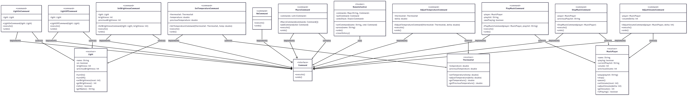

# SmartHome-CommandPattern
Imagine you're building a smart home automation system where various devices (lights, thermostat, music player, etc.) can be controlled remotely using a central hub or app. Each device has different functionalities, but you want to create a unified and flexible control mechanism.

Design a system that allows you to control multiple smart home devices with ease. Your goal is to create a solution where:
1. You can control a variety of devices from a central hub or app, sending commands like "Turn On," "Turn Off," "Increase Temperature," "Decrease Volume," etc.
2. Each device has unique actions associated with these commands. For example, turning on the lights might involve changing their brightness level, while turning on the music player may involve playing a specific playlist.
3. New devices can be seamlessly integrated into the system without modifying existing code. You want to ensure that adding a new device doesn't require changes to the central control logic.
4. Devices can be controlled without the central hub or app needing to understand the internal workings of each device. It should send high-level commands without needing low-level details.

Below is the UML Class Diagram for this project:

# Components 
- **Main (Client):**  
  Acts as the application entry point. It creates the devices (Light, Thermostat, MusicPlayer), wraps them in Command objects, and assigns those commands to the RemoteControl.  
  It simulates user interactions by calling methods on the RemoteControl.

- **RemoteControl (Invoker):**  
  The invoker that stores and executes commands.  
  - `setCommand(String name, Command cmd)`: assigns a command to a slot.  
  - `press(String name)`: executes the assigned command.  
  - `undo()`: undoes the last executed command.  

- **Command (Interface):**  
  Declares two methods:  
  - `execute()`: performs the action.  
  - `undo()`: reverses the action.  
  This ensures all concrete commands share a common contract.

- **Concrete Commands:**  
  Each represents a specific action on a device (Receiver). Examples:  
  - `LightOnCommand` → calls `on()` on a Light.  
  - `LightOffCommand` → calls `off()` on a Light.  
  - `SetBrightnessCommand` → calls `setBrightness(level)` on a Light.  
  - `ThermostatIncreaseTempCommand` → calls `increase()` on a Thermostat.  
  - `ThermostatDecreaseTempCommand` → calls `decrease()` on a Thermostat.  
  - `MusicPlayCommand` → calls `play(playlist)` on a MusicPlayer.  
  - `MusicStopCommand` → calls `stop()` on a MusicPlayer.  
  - `VolumeUpCommand` → calls `volumeUp()` on a MusicPlayer.  
  - `VolumeDownCommand` → calls `volumeDown()` on a MusicPlayer.  

- **Receivers (Devices):**  
  These contain the actual logic of what happens in the system.  
  - **Light** → methods: `on()`, `off()`, `setBrightness(int level)`.  
  - **Thermostat** → methods: `increase()`, `decrease()`.  
  - **MusicPlayer** → methods: `play(String playlist)`, `stop()`, `volumeUp()`, `volumeDown()`.  
